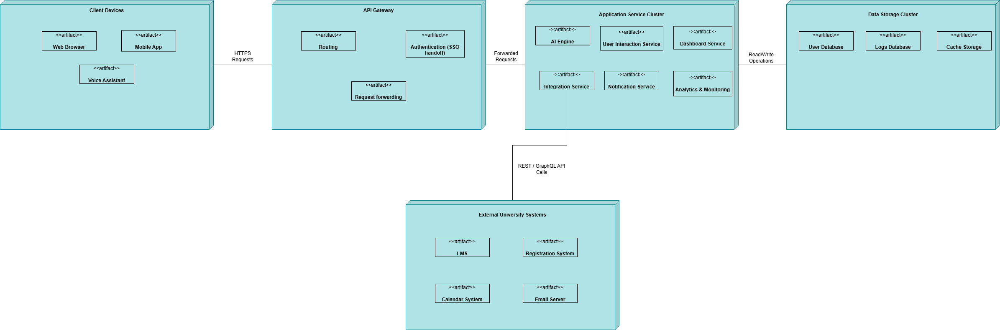

# 1.0 Identify Architectural Drivers
## 1.1 Functional Requirements
The following use cases drive the high-level architecture:
- **UC-1 Academic/Administrative Question**: Core interaction workflow using AI.
- **UC-6 Security System**: SSO authentication and role-based access control.
- **UC-7 Personalized Dashboard**: Student-specific schedules, deadlines, analytics.
- **UC-8 Publish Course Materials**: Lecturer content upload and dissemination.
- **UC-12 Analytics Reporting**: Institutional usage/performance analytics.
- **UC-5 Manage Institutional Integrations**: Connections to LMS, calendar, email, registration.
---
## 1.2 Quality Attributes
| Attribute | Reason for Architectural Impact |
|----------|---------------------------------|
| **Availability** | Requires failover, redundant services. |
| **Security** | Strict SSO, RBAC, encryption, auditing. |
| **Scalability** | Must support 5,000 concurrent users. |
| **Modifiability** | AI model and API key configuration without downtime. |
| **Interoperability** | Must integrate through REST/GraphQL. |
| **Reliability** | Connection retries for failing data sources. |
| **Usability** | Conversational design requires consistent UX. |
---
## 1.3 Constraints
- Must use institutional SSO for authentication.
- Must comply with privacy and data retention policies.
- Must integrate with external systems through REST/GraphQL.
- Must be cloud-deployable, supporting auto-scaling.
- Must maintain ≤2s response time and ≥99.5% availability.
- Must support web, mobile, and voice interfaces.
- Must handle 5000 concurrent users.
- Must provide offline caching.
---
## 1.4 Architectural Concerns
- High-level structural organization for the AI platform.
- Encapsulation of NLP/AI models.
- Secure communication with external systems.
- Observability (logs, metrics, traces).
- Support for zero-downtime upgrades.
- Extensibility for new integrations.
- Consistent and accessible UI experience.
---
# 2.0 Select Reference Architecture & Justification
## Chosen Architecture:
### **Cloud-Native Microservices + Layered Architecture + Event-Driven Extensions**

**Justification**

| Requirement | Architectural Response |
|------------|------------------------|
| High concurrency | Microservices scale independently. |
| AI/NLP processing | Dedicated AI Engine container. |
| External systems | Integration Service with API adapters. |
| Personalization | User Interaction Service + caching. |
| High availability | Cloud replicas, autoscaling, health checks. |
| Modifiability | Encapsulated service boundaries. |
| Performance | Gateway + cache ensures sub-2s response. |

---
# 3.0 High-Level Architectural Decomposition
## 3.1 Major Components
1. **API Gateway**
2. **AI Engine**
3. **User Interaction Service**
4. **Integration Service**
5. **Dashboard Service**
6. **Notification Service**
7. **Analytics & Monitoring Service**
8. **Security & Access Module**
9. **Offline Cache Service**
10. **Database Layer**
---
# 4.0 Deployment View

## 4.1 Deployment Nodes
- **Client Devices:** Web, Mobile, Voice
- **API Gateway:** Cloud load-balanced entry layer
- **Microservices Cluster:**
  - AI Engine
  - User Interaction Service
  - Dashboard Service
  - Integration Service
  - Notification Service
  - Analytics Service
  - Security Module
- **Database Systems:**
  - User DB
  - Logs DB
  - Cache DB
- **External Systems:** LMS, Registration, Calendar, Email
- **Monitoring Stack:** Prometheus / Grafana
---
