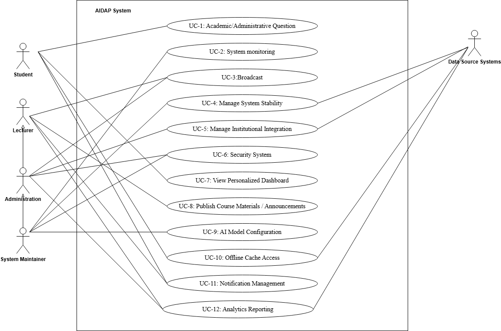

# 2.0 System Requirements
## 2.1 Use Case Model
| Use Case                                       | Description                                                                                                                                                                                                                                                                                                                                                                                                                       |
|------------------------------------------------|-----------------------------------------------------------------------------------------------------------------------------------------------------------------------------------------------------------------------------------------------------------------------------------------------------------------------------------------------------------------------------------------------------------------------------------|
| UC-1: Academic/Administrative Question         | A student can ask an Academic or Administrative question, and the AIDAP will query an AI model, which has access to the relevant data source, to get the proper information(R5)(RS1) (R3)                                                                                                                                                                                                                                         |
| UC-2: System monitoring                        | System Maintainer can view dashboards showing uptime, latency, and error rates to monitor AIDAP health (RM2)(RM4)(RM7)                                                                                                                                                                                                                                                                                                            |
| UC-3:Broadcast                                 | The system will allow wide broadcasting to  (RA3)(RL4)(RS13)                                                                                                                                                                                                                                                                                                                                                                      |
| UC-4: Manage System Stability                  | The system will collect data to maintain data integrity. This will include system access if there if any need for maintenance operations and if there are any issues the system will have automatic fail over and backup recovery  (RD4) (RM6) (RA6)                                                                                                                                                                              |
| UC-5: Manage Institutional Integration         | Administrators configure connections to LMS, registration, calendar,  and email systems using standard APIs (RA1)(RM6)(RA6)                                                                                                                                                                                                                                                                                                       |
| UC-6: Security System                          | When any user signs in to AIDAP, the system authenticates them through the institution’s Single Sign-On service and determines their role-based permissions. Access is restricted so that each user can view only their own or authorized data. All data is encrypted and handled in accordance with institutional privacy and security policies in mind. Any unauthorized access attempts are blocked. (RS8)(RS7)(RL8)(RA5)(R8)  |
| UC-7: View Personalized Dashboard              | Students view personalized dashboards summarizing schedules, deadlines, events and academic performance. (RS3)(RS2)(RS13)                                                                                                                                                                                                                                                                                                         |
| UC-8: Publish Course Materials / Announcements | Lecturers upload course materials and send announcements using conversational commands. (RL1)(RL2)                                                                                                                                                                                                                                                                                                                                |
| UC-9: AI Model Configuration                   | System Maintainers configure AI model versions, API keys, and related parameters. (RM3)(RM5)                                                                                                                                                                                                                                                                                                                                      |
| UC-10: Offline Cache Access                    | The system stores and provides cached responses for students with limited connectivity. (RS14)                                                                                                                                                                                                                                                                                                                                    |
| UC-11: Notification Management                 | Users can customize their notification preferences for reminders, channels, and language. (RS6)(RS2)                                                                                                                                                                                                                                                                                                                              |
| UC-12: Analytics Reporting                     | Administrators and lecturers can view usage analytics, performance, indicators, and class summaries. (RA4)(RL3)                                                                                                                                                                                                                                                                                                                   |

## 2.2 UML Use Case Diagram

